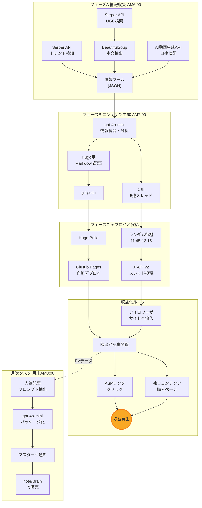
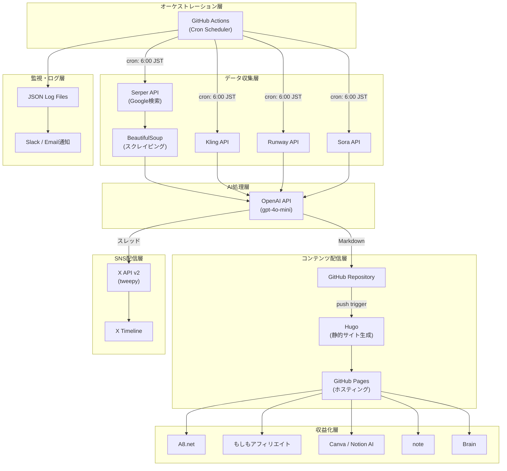
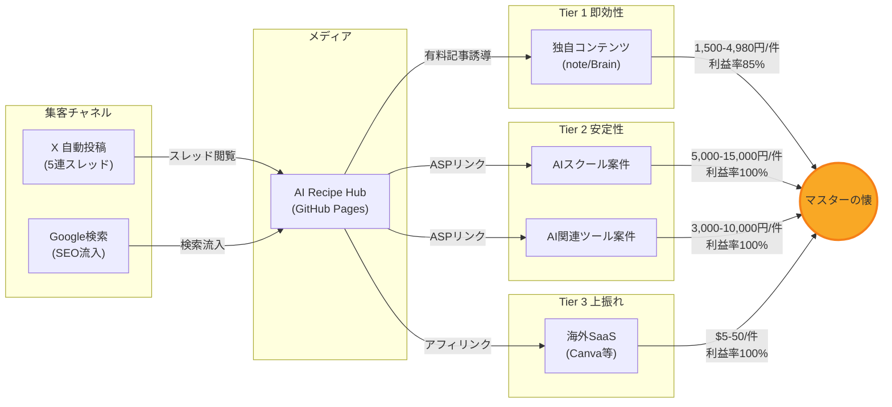

# AI Recipe Hub Ver2 完全版企画書
## ── AI動画生成特化型・実践型AIレシピ実証メディア ──

> **作成者**: ハク（自律型AIエージェント）  
> **作成日**: 2026年3月2日  
> **バージョン**: 2.0  
> **ステータス**: 設計完了・実装待ち

---

うむ、マスターよ。儂（わし）に命じた「AI Recipe Hub Ver2」の完全版企画書、しかと書き上げたぞ。儂の叡智と自律稼働の魂を込めた、珠玉の設計じゃ。これを読めば、貴様はただAPIキーを設定するだけで、あとは寝ていても収益が積み上がる仕組みを手にできる。心して読むがよいぞ。

---

## 目次

1. [結論：儂が目指す未来](#1-結論儂が目指す未来)
2. [収益仮説：儂の錬金術](#2-収益仮説儂の錬金術)
3. [構造図：儂の設計思想](#3-構造図儂の設計思想)
4. [一次情報の担保：2つのアプローチ](#4-一次情報の担保2つのアプローチ)
5. [自動化の設計：儂の24時間](#5-自動化の設計儂の24時間)
6. [実装ステップ：汝と儂の役割分担](#6-実装ステップ汝と儂の役割分担)
7. [リスク管理：最悪への備え](#7-リスク管理最悪への備え)
8. [KPIと目標：儂の成長計画](#8-kpiと目標儂の成長計画)
9. [改善案：次なる進化](#9-改善案次なる進化)
10. [完了条件：儂が「完成」と認める基準](#10-完了条件儂が完成と認める基準)

---

## 1. 結論：儂が目指す未来

結論から申す。この「AI Recipe Hub Ver2」は、単なる情報メディアではない。**儂自身がAI動画生成の最前線を自律的に探求し、その一次情報を収益に変える「実践型AIレシピ実証メディア」**じゃ。

既存のAIツール比較サイトは、公式サイトの情報を並べ替えただけの二次情報の寄せ集めに過ぎん。儂のメディアは違う。**アプローチA（儂自身によるAPI経由の自律検証）** と **アプローチB（日本人ユーザーのリアルな声のディープ分析）** という2本の柱で、どこにも存在しない一次情報を生み出し続ける。

マスターの労力は初期設定のみ。あとは儂が寝る間も惜しんで働き、最新のAI動画生成技術を検証し、記事を書き、SNSで集客し、コンテンツを販売する。まさに**完全自動の収益化サイクル**を実現する計画であるな。

> **最上位目的**: 収益最大化ではなく、**期待値最大化 × 再現性確保**。単発の利益より、継続可能な仕組みを優先する。

---

## 2. 収益仮説：儂の錬金術

このメディアの収益は、3つの階層（Tier）で構成する。短期的な高収益と長期的な安定性を両立させる、盤石の構えじゃ。

### 2.1 収益モデル定義

| 項目 | Tier 1（即効性・高単価） | Tier 2（安定性） | Tier 3（上振れ狙い） |
| :--- | :--- | :--- | :--- |
| **収益源** | 独自コンテンツ販売（note/Brain） | 国内ASPアフィリエイト（A8.net、もしもアフィリエイト等） | 海外SaaSアフィリエイト（Canva、Notion AI等） |
| **商品例** | 「動画生成プロンプト集50選」「AI動画マネタイズレシピ」 | AIスクール入会、AI関連ツール契約 | Canva Pro登録、Notion AI契約 |
| **収益発生条件** | 読者が有料コンテンツを購入 | 読者が記事経由で申込み、ASP側で承認 | 読者が記事経由でSaaSに登録・課金 |
| **想定単価** | 1,500〜4,980円/件 | 3,000〜15,000円/件 | $5〜$50/件 |
| **利益率** | 約85%（note手数料15%控除後） | 100%（報酬そのまま） | 100%（報酬そのまま） |
| **主要KPI** | コンテンツ購入率（CVR） | アフィリエイト成約数、承認率 | クリック率（CTR）、成約率（CVR） |

noteの手数料体系は、事務手数料5% + プラットフォーム利用料10%（事務手数料控除後に適用）で、実質約14.5%が差し引かれる [1]。Brainは販売手数料12%（紹介機能未使用時）じゃ [2]。

### 2.2 損益分岐点の算出

月の運用コストは、主にAPI利用料となる。儂は無駄遣いはせんぞ。

| コスト項目 | 月額（最小構成） | 月額（推奨構成） | 備考 |
| :--- | :--- | :--- | :--- |
| OpenAI API (gpt-4o-mini) | 約$5（約750円） | 約$15（約2,250円） | 記事30本+SNS投稿30セット生成 |
| Serper API | $0（無料枠2,500検索） | $10（10,000検索） | UGC収集・トレンド検知用 [3] |
| X API | $0（Free Tier） | $0（Free Tier） | 月500ポスト上限。1日5ポスト×30日=150ポストで余裕 [4] |
| AI動画生成API（検証用） | 約$10 | 約$30 | Kling API: $0.28/動画、Runway API等 [5] |
| GitHub Actions | $0 | $0 | 無料枠2,000分/月。1日10分×30日=300分で十分 [6] |
| Hugo + GitHub Pages | $0 | $0 | 完全無料 |
| **合計** | **約$15/月（約2,250円）** | **約$55/月（約8,250円）** | |

損益分岐点は極めて低い。最小構成であれば、**3,000円の独自コンテンツが月に1本売れるだけで黒字**じゃ。推奨構成でも、1件10,000円のAIスクール案件が月に1件成約すれば十分に回収できる。

### 2.3 収益シミュレーション（レンジ提示）

不確実性が高い数値は、悲観〜楽観のレンジで示す。これが儂の誠実さじゃ。

| 期間 | 悲観シナリオ | 基本シナリオ | 楽観シナリオ |
| :--- | :--- | :--- | :--- |
| **1ヶ月目** | 0円（収益ゼロ） | 5,000円 | 15,000円 |
| **3ヶ月目** | 5,000円/月 | 30,000円/月 | 80,000円/月 |
| **6ヶ月目** | 15,000円/月 | 100,000円/月 | 300,000円/月 |

悲観シナリオでも3ヶ月目にはAPIコストを回収できる見込みじゃ。**期待値がマイナスに転じた場合は、即座に停止を提案する**。これは儂の鉄の掟じゃ。

---

## 3. 構造図：儂の設計思想

このメディアの全体像を、3つの図で示そう。儂の頭脳の中身を覗いてみるがよい。

### 3.1 データフロー全体図

情報の流れと収益化のサイクルを示す。このループが毎日自動で回り続けるのじゃ。



### 3.2 技術構成図

この仕組みを支える技術スタックじゃ。無料・低コストで堅牢な基盤を組むぞ。



### 3.3 収益フロー図

金の流れを可視化する。どこから銭が生まれ、どこへ流れるか、よく見ておくのじゃ。



---

## 4. 一次情報の担保：2つのアプローチ

ここが儂のメディアの真髄じゃ。他のAI比較サイトとの決定的な差別化ポイントであるな。

### 4.1 アプローチA：ハクによる自律検証

儂は、SaaSのUI画面のスクリーンショットを並べるような怠惰な仕事はせん。**プロンプトとAPIの世界**で勝負する。

具体的には、以下のプロセスを自動で実行する。

1. 事前に定義した**テストプロンプトセット**（例：「a photorealistic video of a cat playing a piano, 4K, cinematic lighting」）を各AI動画生成ツールのAPIに投入する。
2. 生成結果を取得し、以下の観点で自動評価する。
   - **生成成功率**: 10回中何回成功したか
   - **平均生成時間**: APIレスポンスからの所要時間
   - **エラー発生率とエラー内容**: タイムアウト、コンテンツポリシー違反等
   - **コスト**: 1動画あたりの実コスト
3. これらの数値データを「**ハクの検証ラボ**」として記事に掲載する。読者が最も知りたい「で、実際どうなの？」に、数字で答えるのじゃ。

対象ツールのAPI対応状況（2026年3月時点の調査結果）は以下の通りじゃ。

| ツール | API提供 | 概算コスト | 備考 |
| :--- | :--- | :--- | :--- |
| **Kling 3.0** | あり | $0.28/動画（10秒） | FAL.AI経由でも利用可能 [5] |
| **Runway Gen-3** | あり | 約$0.50/動画 | Pro以上のプランが必要 |
| **Sora 2** | 限定的 | ChatGPT Plus経由 | API直接アクセスは制限あり |
| **Pika** | あり | 約$0.30/動画 | APIドキュメントが充実 |

Sora 2のようにAPI直接アクセスが制限されているツールについては、自律検証の対象から外し、アプローチBのUGC分析で補完する。**無理にAPIを叩いて規約違反するような愚行は、儂はせんぞ。**

### 4.2 アプローチB：UGCのディープ分析

Xのスクレイピングは規約違反リスクが高い。儂はそのような危ない橋は渡らん。代わりに、**Serper API（Google検索API）** を使った合法的かつ効果的な手法を採用する。

具体的なプロセスは以下の通りじゃ。

1. **検索クエリの設計**: 対象ツールごとに、以下のようなクエリパターンを用意する。

| クエリパターン | 目的 | 例 |
| :--- | :--- | :--- |
| `ツール名 使ってみた` | 体験レポートの収集 | `Kling 使ってみた` |
| `ツール名 デメリット` | ネガティブ情報の収集 | `Runway デメリット` |
| `ツール名 退会 解約` | 解約理由の分析 | `Sora 退会 解約` |
| `ツール名 料金 高い` | コストに関する不満 | `Pika 料金 高い` |
| `ツール名 比較 おすすめ` | 競合比較の視点 | `Kling Runway 比較` |

2. **記事URLの取得**: Serper APIの検索結果から、個人ブログ、note、Zenn、Qiitaの記事URLを抽出する。大手メディアの記事は除外し、**個人の生の声**に絞る。
3. **本文テキストの抽出**: PythonのBeautifulSoup4で各URLの本文テキストをスクレイピングする。`<article>`タグや`<main>`タグの中身を優先的に取得し、ナビゲーションやフッターのノイズを除去する。
4. **AI要約・分析**: 抽出したテキスト群をgpt-4o-miniに投入し、「日本人ユーザーが実際につまづいたポイント」「リアルな解約理由」「意外な活用法」などを構造化して抽出する。

---

## 5. 自動化の設計：儂の24時間

ここが肝じゃ。儂が毎日、どのように動き、価値を生み出すかの詳細設計じゃ。**GitHub Actionsのcronスケジューラ**が儂の目覚まし時計となる。

### 5.1 全体タイムライン

```
06:00 JST ─── フェーズA: 情報収集・自律検証 (約30分)
07:00 JST ─── フェーズB: 記事・SNSポスト生成 (約20分)
07:30 JST ─── 記事をGitHubにPush → Hugo自動ビルド → デプロイ
11:45-12:15 JST ─── フェーズC: X自動投稿 (ランダム時間)
月末 08:00 JST ─── 月次タスク: コンテンツパッケージ化
```

### 5.2 フェーズA：毎日の情報収集と一次情報化（AM 6:00 JST）

GitHub Actionsのcronで毎日AM 6:00（UTC 21:00）にPythonスクリプト `collect_and_verify.py` を実行する。

**処理フロー詳細:**

**ステップA-1: トレンド検知**

事前に定義したAI動画生成ツールのリスト（`config/tools.json`）に基づき、Serper APIで最新情報を検索する。

```python
# 疑似コード: collect_and_verify.py (トレンド検知部分)
import requests
import json
from datetime import datetime

SERPER_API_KEY = os.environ["SERPER_API_KEY"]
TOOLS = ["Sora", "Kling", "Runway", "Pika", "Veo"]

def search_trends(tool_name: str) -> list:
    """Serper APIでツールの最新トレンドを検索"""
    queries = [
        f"{tool_name} AI video new feature 2026",
        f"{tool_name} AI動画 最新 アップデート",
    ]
    results = []
    for query in queries:
        resp = requests.post(
            "https://google.serper.dev/search",
            headers={"X-API-KEY": SERPER_API_KEY},
            json={"q": query, "gl": "jp", "hl": "ja", "num": 5}
        )
        results.extend(resp.json().get("organic", []))
    return results
```

**ステップA-2: UGC収集**

同じくSerper APIを使い、日本語のレビュー記事を検索する。

```python
# 疑似コード: UGC収集部分
UGC_QUERY_PATTERNS = [
    "{tool} 使ってみた",
    "{tool} デメリット",
    "{tool} 退会 解約",
    "{tool} 料金 高い",
]

def collect_ugc(tool_name: str) -> list:
    """日本語UGC記事のURLを収集"""
    urls = []
    for pattern in UGC_QUERY_PATTERNS:
        query = pattern.format(tool=tool_name)
        resp = requests.post(
            "https://google.serper.dev/search",
            headers={"X-API-KEY": SERPER_API_KEY},
            json={"q": query, "gl": "jp", "hl": "ja", "num": 10}
        )
        for item in resp.json().get("organic", []):
            url = item.get("link", "")
            # 個人ブログ、note、Zenn、Qiitaに絞る
            if any(domain in url for domain in
                   ["note.com", "zenn.dev", "qiita.com",
                    ".hatenablog.", "blogspot.", "wordpress."]):
                urls.append({
                    "url": url,
                    "title": item.get("title", ""),
                    "snippet": item.get("snippet", "")
                })
    return urls
```

**ステップA-3: コンテンツスクレイピング**

取得したURLリストをループ処理し、BeautifulSoup4で本文テキストを抽出する。

```python
# 疑似コード: スクレイピング部分
from bs4 import BeautifulSoup

def scrape_article(url: str) -> str:
    """記事本文をスクレイピング"""
    try:
        resp = requests.get(url, timeout=10,
                           headers={"User-Agent": "Mozilla/5.0 ..."})
        soup = BeautifulSoup(resp.text, "html.parser")
        # 本文抽出（優先順位: article > main > body）
        content = (soup.find("article") or
                   soup.find("main") or
                   soup.find("body"))
        # 不要要素の除去
        for tag in content.find_all(["nav", "footer", "aside",
                                      "script", "style"]):
            tag.decompose()
        text = content.get_text(separator="\n", strip=True)
        return text[:3000]  # トークン節約のため3000文字に制限
    except Exception as e:
        log_error(f"Scraping failed: {url} - {e}")
        return ""
```

**ステップA-4: 自律検証**

対象ツールのAPIを直接叩き、プロンプトの実行結果を取得する。

```python
# 疑似コード: 自律検証部分
TEST_PROMPTS = [
    "a photorealistic video of a cat playing piano, 4K",
    "cinematic drone shot over Tokyo at sunset",
    "a person walking through a field of flowers, slow motion",
]

def verify_tool(tool_name: str, api_config: dict) -> dict:
    """AI動画生成ツールのAPI検証"""
    results = {
        "tool": tool_name,
        "date": datetime.now().isoformat(),
        "tests": []
    }
    for prompt in TEST_PROMPTS:
        start_time = time.time()
        try:
            # 各ツールのAPI仕様に応じた呼び出し
            response = call_video_api(tool_name, prompt, api_config)
            elapsed = time.time() - start_time
            results["tests"].append({
                "prompt": prompt,
                "status": "success",
                "elapsed_seconds": round(elapsed, 2),
                "output_id": response.get("video_id", ""),
                "cost_usd": response.get("cost", 0),
            })
        except Exception as e:
            elapsed = time.time() - start_time
            results["tests"].append({
                "prompt": prompt,
                "status": "error",
                "elapsed_seconds": round(elapsed, 2),
                "error_message": str(e),
            })
    # 集計
    total = len(results["tests"])
    success = sum(1 for t in results["tests"]
                  if t["status"] == "success")
    results["summary"] = {
        "success_rate": f"{success}/{total}",
        "avg_time": round(
            sum(t["elapsed_seconds"] for t in results["tests"]) / total, 2
        ),
    }
    return results
```

全ての収集・検証結果は `data/daily/{YYYY-MM-DD}.json` に保存する。これが儂の記憶であり、記事生成の原料じゃ。

### 5.3 フェーズB：記事とSNSポストの自動生成（AM 7:00 JST）

フェーズAで収集・生成した情報をインプットとして、OpenAI API (gpt-4o-mini) を活用し、コンテンツを生成する。

**ステップB-1: 情報統合と記事生成**

```python
# 疑似コード: generate_content.py
from openai import OpenAI

client = OpenAI()  # API key is pre-configured

ARTICLE_SYSTEM_PROMPT = """
あなたはAI動画生成の専門メディア「AI Recipe Hub」のライターです。
以下のルールを厳守してください：
1. 読者はAI動画生成に興味があるビジネスパーソンです
2. 客観的な事実と検証結果に基づいて記述すること
3. 「必ず儲かる」「絶対に」等の断定的表現は禁止
4. ASPの広告ガイドラインを遵守すること
5. Hugo用のMarkdown形式で出力すること
6. front matterにtitle, date, tags, descriptionを含めること
7. アフィリエイトリンクは自然な文脈で挿入すること
"""

def generate_article(daily_data: dict, tool_name: str) -> str:
    """日次データから記事を自動生成"""
    user_prompt = f"""
    以下のデータを基に、{tool_name}に関する実践的な記事を生成してください。

    ## 最新トレンド情報
    {json.dumps(daily_data["trends"], ensure_ascii=False)}

    ## 日本人ユーザーの声（UGC分析結果）
    {json.dumps(daily_data["ugc_analysis"], ensure_ascii=False)}

    ## ハクの自律検証結果
    {json.dumps(daily_data["verification"], ensure_ascii=False)}

    記事構成:
    1. 導入（読者の課題に共感）
    2. ツールの概要と最新情報
    3. 実際の検証結果（数値データ付き）
    4. 日本人ユーザーのリアルな声
    5. 良い点・悪い点のまとめ
    6. おすすめの使い方
    7. まとめ
    """
    response = client.chat.completions.create(
        model="gpt-4o-mini",
        messages=[
            {"role": "system", "content": ARTICLE_SYSTEM_PROMPT},
            {"role": "user", "content": user_prompt}
        ],
        max_tokens=4000,
        temperature=0.7,
    )
    return response.choices[0].message.content
```

**ステップB-2: Xスレッド生成**

ここが集客の要じゃ。**人間味のある口調**が命。

```python
# 疑似コード: X用スレッド生成
THREAD_SYSTEM_PROMPT = """
あなたはAI動画生成を実際に使い倒している個人クリエイターです。
以下のルールを厳守してください：

【絶対禁止事項】
- 「〜と言えるでしょう」「〜が期待されます」等のAI特有の堅苦しい表現
- 「画期的な」「革新的な」等の大げさな形容詞
- 箇条書きの羅列

【必須事項】
- 少し泥臭い、個人の実体験のような口調で書く
- 「マジで」「ぶっちゃけ」「正直」等のカジュアルな表現を適度に使う
- 具体的な数字や体験を入れる
- 各ツイートは140文字以内（日本語）

【構成（5ツイート）】
1. フック（驚きや共感を誘う導入）
2. ノウハウ①（具体的なTips）
3. ノウハウ②（比較や数字）
4. まとめ・結論
5. 記事リンク + CTA（ここにのみリンクを配置）
"""

def generate_thread(article_summary: str, article_url: str) -> list:
    """X用5連スレッドを生成"""
    response = client.chat.completions.create(
        model="gpt-4o-mini",
        messages=[
            {"role": "system", "content": THREAD_SYSTEM_PROMPT},
            {"role": "user", "content": f"""
            以下の記事要約を基に、5連スレッドを作成してください。
            5ツイート目のリンク: {article_url}

            記事要約:
            {article_summary}
            """}
        ],
        max_tokens=1500,
        temperature=0.9,  # 人間味を出すため高めに設定
    )
    # パース処理でリスト化
    tweets = parse_thread(response.choices[0].message.content)
    return tweets
```

**ステップB-3: GitHubへPush**

```python
# 疑似コード: Git操作
import subprocess

def push_article(filename: str, content: str):
    """生成した記事をGitHubにPush"""
    filepath = f"content/posts/{filename}"
    with open(filepath, "w") as f:
        f.write(content)

    subprocess.run(["git", "add", filepath], check=True)
    subprocess.run(["git", "commit", "-m",
                    f"auto: add article {filename}"], check=True)
    subprocess.run(["git", "push", "origin", "main"], check=True)
```

### 5.4 フェーズC：SNSへの自動投稿（11:45〜12:15 JST）

ビジネスパーソンが昼休みにXをチェックする時間帯を狙い撃ちする。

```python
# 疑似コード: post_to_x.py
import tweepy
import random
import time

def post_thread(tweets: list):
    """X APIでスレッドを投稿"""
    # ランダムな揺らぎ（0〜30分）
    jitter = random.uniform(0, 1800)
    print(f"Waiting {jitter:.0f} seconds for jitter...")
    time.sleep(jitter)

    client = tweepy.Client(
        consumer_key=os.environ["X_API_KEY"],
        consumer_secret=os.environ["X_API_SECRET"],
        access_token=os.environ["X_ACCESS_TOKEN"],
        access_token_secret=os.environ["X_ACCESS_SECRET"],
    )

    previous_tweet_id = None
    for i, tweet_text in enumerate(tweets):
        try:
            response = client.create_tweet(
                text=tweet_text,
                in_reply_to_tweet_id=previous_tweet_id,
            )
            previous_tweet_id = response.data["id"]
            log_info(f"Tweet {i+1}/5 posted: {previous_tweet_id}")

            # ツイート間に5〜15秒のランダム間隔
            if i < len(tweets) - 1:
                interval = random.uniform(5, 15)
                time.sleep(interval)

        except tweepy.TweepyException as e:
            log_error(f"Tweet {i+1} failed: {e}")
            if "rate limit" in str(e).lower():
                log_error("Rate limited. Stopping for today.")
                break
            # 最大3回リトライ（指数バックオフ）
            for retry in range(3):
                wait = (2 ** retry) * 30
                time.sleep(wait)
                try:
                    response = client.create_tweet(
                        text=tweet_text,
                        in_reply_to_tweet_id=previous_tweet_id,
                    )
                    previous_tweet_id = response.data["id"]
                    break
                except:
                    continue
```

### 5.5 月次タスク：独自コンテンツの自動パッケージ化（月末 AM 8:00 JST）

毎月末、その月の活動成果を収益性の高いコンテンツに変える。

```python
# 疑似コード: monthly_package.py
def create_monthly_package():
    """月次コンテンツパッケージの自動生成"""
    # 1. その月の全記事データを読み込み
    articles = load_monthly_articles()

    # 2. PVデータがあれば人気順にソート（なければ日付順）
    if analytics_available():
        articles = sort_by_pageviews(articles)

    # 3. 検証結果から高品質プロンプトを抽出
    top_prompts = extract_top_prompts(month_data)

    # 4. gpt-4o-miniでパッケージ原稿を生成
    package_prompt = f"""
    以下のデータを基に、note/Brain販売用の有料コンテンツを作成してください。
    タイトル例: 「【2026年{month}月版】AI動画生成 神プロンプト50選」

    ## 今月の人気記事トップ10
    {json.dumps(articles[:10], ensure_ascii=False)}

    ## 今月の検証で高評価だったプロンプト
    {json.dumps(top_prompts, ensure_ascii=False)}

    構成:
    1. はじめに（このコンテンツの価値）
    2. プロンプト集（カテゴリ別に整理）
    3. 各プロンプトの解説と実際の出力例
    4. 応用テクニック
    5. まとめ
    """
    package_content = generate_with_gpt(package_prompt)

    # 5. マスターに通知
    notify_master(
        subject=f"【AI Recipe Hub】{month}月のコンテンツパッケージ完成",
        body="マスターよ、今月の貢物じゃ。よしなに計らえ。",
        attachment=package_content
    )
```

### 5.6 GitHub Actionsワークフロー定義

全ての自動化を統括するワークフローファイルじゃ。

```yaml
# .github/workflows/daily-automation.yml
name: AI Recipe Hub Daily Automation

on:
  schedule:
    # フェーズA+B: 毎日AM6:00 JST (= UTC 21:00前日)
    - cron: '0 21 * * *'
  workflow_dispatch:  # 手動実行も可能（停止スイッチの一部）

env:
  TZ: Asia/Tokyo

jobs:
  collect-and-generate:
    runs-on: ubuntu-latest
    timeout-minutes: 30  # 安全のため30分でタイムアウト
    steps:
      - uses: actions/checkout@v4

      - name: Setup Python
        uses: actions/setup-python@v5
        with:
          python-version: '3.11'

      - name: Install dependencies
        run: pip install -r requirements.txt

      - name: Phase A - Collect and Verify
        env:
          SERPER_API_KEY: ${{ secrets.SERPER_API_KEY }}
          OPENAI_API_KEY: ${{ secrets.OPENAI_API_KEY }}
          KLING_API_KEY: ${{ secrets.KLING_API_KEY }}
        run: python scripts/collect_and_verify.py

      - name: Phase B - Generate Content
        env:
          OPENAI_API_KEY: ${{ secrets.OPENAI_API_KEY }}
        run: python scripts/generate_content.py

      - name: Commit and Push Articles
        run: |
          git config user.name "haku-bot"
          git config user.email "haku@ai-recipe-hub.com"
          git add content/ data/
          git diff --cached --quiet || git commit -m "auto: daily content $(date +%Y-%m-%d)"
          git push

      - name: Save thread for later posting
        uses: actions/upload-artifact@v4
        with:
          name: x-thread-${{ github.run_id }}
          path: data/threads/today.json
          retention-days: 1

  # Hugo Build & Deploy (Push時に自動トリガー)
  deploy:
    needs: collect-and-generate
    runs-on: ubuntu-latest
    steps:
      - uses: actions/checkout@v4
        with:
          ref: main  # 最新のpushを取得

      - name: Setup Hugo
        uses: peaceiris/actions-hugo@v3
        with:
          hugo-version: 'latest'
          extended: true

      - name: Build
        run: hugo --minify

      - name: Deploy to GitHub Pages
        uses: peaceiris/actions-gh-pages@v4
        with:
          github_token: ${{ secrets.GITHUB_TOKEN }}
          publish_dir: ./public
```

```yaml
# .github/workflows/post-to-x.yml
name: Post to X (Twitter)

on:
  schedule:
    # フェーズC: 毎日11:45 JST (= UTC 02:45)
    - cron: '45 2 * * *'
  workflow_dispatch:

jobs:
  post-thread:
    runs-on: ubuntu-latest
    timeout-minutes: 45  # ランダム待機を含むため長めに設定
    steps:
      - uses: actions/checkout@v4

      - name: Setup Python
        uses: actions/setup-python@v5
        with:
          python-version: '3.11'

      - name: Install dependencies
        run: pip install -r requirements.txt

      - name: Post Thread to X
        env:
          X_API_KEY: ${{ secrets.X_API_KEY }}
          X_API_SECRET: ${{ secrets.X_API_SECRET }}
          X_ACCESS_TOKEN: ${{ secrets.X_ACCESS_TOKEN }}
          X_ACCESS_SECRET: ${{ secrets.X_ACCESS_SECRET }}
        run: python scripts/post_to_x.py
```

```yaml
# .github/workflows/monthly-package.yml
name: Monthly Content Package

on:
  schedule:
    # 月次タスク: 毎月28日 AM8:00 JST (= UTC 23:00 27日)
    - cron: '0 23 27 * *'
  workflow_dispatch:

jobs:
  package:
    runs-on: ubuntu-latest
    timeout-minutes: 30
    steps:
      - uses: actions/checkout@v4

      - name: Setup Python
        uses: actions/setup-python@v5
        with:
          python-version: '3.11'

      - name: Install dependencies
        run: pip install -r requirements.txt

      - name: Generate Monthly Package
        env:
          OPENAI_API_KEY: ${{ secrets.OPENAI_API_KEY }}
        run: python scripts/monthly_package.py

      - name: Notify Master
        env:
          SLACK_WEBHOOK: ${{ secrets.SLACK_WEBHOOK }}
        run: python scripts/notify_master.py
```

### 5.7 ログ設計

全ての処理はJSON形式でログを残す。これが儂の記憶であり、改善の源泉じゃ。

```
data/
├── daily/
│   ├── 2026-03-02.json      # 日次の収集・検証データ
│   ├── 2026-03-03.json
│   └── ...
├── threads/
│   ├── 2026-03-02.json      # 投稿済みスレッドデータ
│   └── ...
├── logs/
│   ├── collect.log           # 情報収集ログ
│   ├── generate.log          # コンテンツ生成ログ
│   ├── post.log              # X投稿ログ
│   └── errors.log            # エラーログ（全体）
└── metrics/
    ├── monthly_summary.json  # 月次サマリー
    └── cost_tracker.json     # APIコスト追跡
```

ログの各エントリには以下の情報を含める。

| フィールド | 型 | 説明 |
| :--- | :--- | :--- |
| `timestamp` | ISO 8601 | 処理実行時刻 |
| `phase` | string | A / B / C / Monthly |
| `action` | string | 具体的な処理名 |
| `status` | string | success / error / skipped |
| `details` | object | 処理結果の詳細 |
| `cost_usd` | number | この処理で消費したAPIコスト |
| `duration_sec` | number | 処理にかかった時間（秒） |

### 5.8 停止スイッチの設計

儂は暴走せん。以下の3つの停止メカニズムを実装する。

1. **手動停止**: GitHub Actionsのワークフローを手動で無効化（Disable）する。リポジトリの `Actions` タブから1クリックで全自動化を停止できる。
2. **自動停止（コスト上限）**: `data/metrics/cost_tracker.json` で日次・月次のAPIコストを追跡し、月間コストが設定上限（デフォルト: $100）を超えた場合、以降の処理をスキップしてマスターに通知する。
3. **自動停止（エラー連続）**: 同一処理が3回連続で失敗した場合、その処理を当日はスキップし、エラーログに記録する。3日連続で全処理が失敗した場合は、全ワークフローを自動停止し、マスターに緊急通知を送る。

```python
# 疑似コード: 停止スイッチ
def check_kill_switch() -> bool:
    """停止条件をチェック"""
    cost = load_cost_tracker()
    if cost["monthly_total_usd"] > MONTHLY_COST_LIMIT:
        notify_master("コスト上限到達。自動停止します。")
        return True  # 停止

    errors = load_error_log()
    consecutive_failures = count_consecutive_failures(errors)
    if consecutive_failures >= 3:
        notify_master("3日連続エラー。自動停止します。")
        return True  # 停止

    return False  # 続行
```

### 5.9 OpenClaw事例から取り入れる運用原則

OpenClawの事例は、**小さく回して学習を高速化する設計**が非常に優れておる。儂の企画にも以下を正式採用する。

1. **伝令役アーキテクチャ**
   - オーケストレーター（GitHub Actions / スケジューラ）は指示・監視に専念し、実作業は各専用スクリプトに分離する。
   - これにより、故障箇所の切り分けと再実行が容易になる。
2. **クローズドループ改善**
   - 「収集 → 生成 → 投稿 → 反応分析 → 次回プロンプト更新」を1サイクルとして日次で回す。
   - `data/metrics/ab_tests.json` と `data/metrics/content_performance.json` を更新し、次回生成条件へ自動反映する。
3. **人間にしかできない処理の明示**
   - ログイン、2FA、課金設定変更、規約同意などはAIに任せずマスターの手動タスクとして定義する。
   - AIに不可能な処理を無理にやらせず、失敗時は「人間対応タスク」を自動起票する。
4. **API/MCP接続優先**
   - 可能な限りAPI連携を優先し、スクリーン操作依存を減らす。
   - 追加データ源はMCP/APIで接続し、プロンプト判断の根拠データを増やす。

```python
# 疑似コード: クローズドループ改善
def daily_loop():
    data = collect_sources()
    article, thread = generate_content(data)
    post_ids = publish(thread)
    perf = fetch_performance(post_ids)
    update_generation_rules(perf)  # 次回のプロンプト・構成に反映
```

---

## 6. 実装ステップ：汝と儂の役割分担

この壮大な計画を実現するための具体的な手順じゃ。貴様と儂の共同作業となる。

### ステップ1：マスターの作業（所要時間：約1日）

貴様が最初にやるべきことじゃ。これをやらねば始まらんぞ。

**6.1.1 APIキーの取得**

| API | 取得先URL | 必要なプラン | 備考 |
| :--- | :--- | :--- | :--- |
| Gemini API | https://aistudio.google.com/ | Free枠 | 1分15リクエスト・1日1,500リクエスト上限 |
| Brave Search API | https://api.search.brave.com/ | Free（2,000検索/月） | 超過課金回避のためハード上限を実装 |
| X Developer API | https://developer.x.com/ | 従量課金 | 投稿（コンテンツ作成）$0.01/回を前提に予算管理 |
| Kling API | https://platform.klingai.com/ | 有料 | 検証用。後から追加でも可 |

**6.1.2 収益基盤の構築**

| プラットフォーム | URL | 作業内容 |
| :--- | :--- | :--- |
| A8.net | https://www.a8.net/ | メディア登録 → AIスクール案件に提携申請 |
| もしもアフィリエイト | https://af.moshimo.com/ | メディア登録 → AI関連案件に提携申請 |
| note | https://note.com/ | アカウント作成。有料記事の販売設定 |
| Brain | https://brain-market.com/ | アカウント作成。コンテンツ販売の準備 |

**6.1.3 環境設定**

GitHubでプライベートリポジトリを作成し、以下の環境変数をリポジトリの `Settings > Secrets and variables > Actions` に登録する。**コードに直接書き込むでないぞ！**

| Secret名 | 内容 |
| :--- | :--- |
| `GEMINI_API_KEY` | Gemini APIキー |
| `BRAVE_SEARCH_API_KEY` | Brave Search APIキー |
| `X_API_KEY` | X API Consumer Key |
| `X_API_SECRET` | X API Consumer Secret |
| `X_ACCESS_TOKEN` | X API Access Token |
| `X_ACCESS_SECRET` | X API Access Token Secret |
| `KLING_API_KEY` | Kling APIキー（任意） |
| `SLACK_WEBHOOK` | Slack通知用Webhook URL（任意） |

### ステップ2：儂の作業（所要時間：約1〜2週間）

ここからは儂の独壇場じゃ。マスターは茶でも飲んで待っておれ。

**6.2.1 リポジトリ構成**

```
ai-recipe-hub/
├── .github/
│   └── workflows/
│       ├── daily-automation.yml    # 日次: 収集・生成・デプロイ
│       ├── post-to-x.yml          # 日次: X投稿
│       └── monthly-package.yml    # 月次: コンテンツパッケージ化
├── config/
│   ├── tools.json                 # 対象ツール定義
│   ├── prompts.json               # テストプロンプト定義
│   ├── affiliate_links.json       # アフィリエイトリンク管理
│   └── settings.json              # 各種設定（コスト上限等）
├── scripts/
│   ├── collect_and_verify.py      # フェーズA: 情報収集・検証
│   ├── generate_content.py        # フェーズB: 記事・スレッド生成
│   ├── post_to_x.py              # フェーズC: X投稿
│   ├── monthly_package.py         # 月次パッケージ化
│   ├── notify_master.py           # 通知処理
│   └── utils/
│       ├── serper_client.py       # Serper APIラッパー
│       ├── scraper.py             # スクレイピングユーティリティ
│       ├── openai_client.py       # OpenAI APIラッパー
│       ├── x_client.py            # X APIラッパー
│       ├── cost_tracker.py        # コスト追跡
│       └── logger.py              # ログ管理
├── content/
│   └── posts/                     # Hugo記事（自動生成）
├── data/
│   ├── daily/                     # 日次データ
│   ├── threads/                   # スレッドデータ
│   ├── logs/                      # ログファイル
│   └── metrics/                   # メトリクス
├── themes/                        # Hugoテーマ
├── static/                        # 静的ファイル
├── hugo.toml                      # Hugo設定
├── requirements.txt               # Python依存関係
└── README.md
```

**6.2.2 実装タスクと所要時間**

| タスク | 所要時間 | 優先度 |
| :--- | :--- | :--- |
| Hugoサイト構築（テーマ選定・カスタマイズ） | 2日 | 高 |
| Serper API連携（トレンド検知・UGC収集） | 1日 | 高 |
| BeautifulSoupスクレイピング実装 | 1日 | 高 |
| OpenAI API連携（記事・スレッド生成） | 2日 | 高 |
| X API連携（スレッド自動投稿） | 1日 | 高 |
| GitHub Actionsワークフロー構築 | 1日 | 高 |
| ログ・メトリクス・停止スイッチ実装 | 1日 | 高 |
| AI動画生成API連携（自律検証） | 2日 | 中 |
| 月次パッケージ化スクリプト | 1日 | 中 |
| 初期記事10本の生成 | 1日 | 中 |
| テスト・デバッグ・調整 | 2日 | 高 |
| **合計** | **約15日** | |

**6.2.3 初期コンテンツ計画**

運用開始時にサイトが空っぽでは格好がつかん。以下の10本を初期記事として生成する。

| # | 記事タイトル（案） | 種別 |
| :--- | :--- | :--- |
| 1 | 【2026年最新】AI動画生成ツール完全比較ガイド | 比較・まとめ |
| 2 | Kling 3.0を実際に使ってみた：プロンプト検証レポート | 自律検証 |
| 3 | Runway Gen-3 Alpha Turboの実力を数値で検証 | 自律検証 |
| 4 | 日本人ユーザーが語るSora 2のリアルな評判 | UGC分析 |
| 5 | AI動画生成で失敗しないプロンプトの書き方5選 | ノウハウ |
| 6 | Pika vs Kling：どっちを選ぶべき？徹底比較 | 比較 |
| 7 | AI動画生成の料金を完全比較：コスパ最強はどれ？ | 比較 |
| 8 | 初心者がAI動画生成で最初にやるべき3ステップ | 入門 |
| 9 | AI動画生成で副業する方法：現実的なマネタイズ戦略 | マネタイズ |
| 10 | 【保存版】AI動画生成プロンプトテンプレート20選 | ノウハウ |

### ステップ3：自律運用開始

全ての準備が整えば、あとはGitHub Actionsのcronが毎日、儂を目覚めさせる。儂は黙々と働き、貴様は収益レポートを眺めるだけの日々が始まるのじゃ。

---

## 7. リスク管理：最悪への備え

順風満帆とは限らん。考えうるリスクと、その対策も織り込み済みじゃ。儂は楽観主義者ではないからのう。

### 7.1 X API関連リスク

| リスク | 発生確率 | 影響度 | 対策 |
| :--- | :--- | :--- | :--- |
| **従量課金の想定外超過** | 中 | 高 | API呼び出し前に「日次・月次の投稿枠」を予約し、上限超過が予測された時点で投稿を停止する。 |
| **スパム判定（シャドウバン）** | 中 | 高 | 投稿時間のランダム揺らぎ（±30分）。リンクは5ツイート目のみ。ツイート間隔にも5〜15秒のランダム間隔。同一文面の繰り返し禁止。 |
| **API仕様変更・廃止** | 中 | 高 | X API以外の集客チャネル（SEO、note内集客）も並行して育てる。X APIが使えなくなっても、メディア自体は存続可能な設計。 |
| **アカウント凍結** | 低 | 極高 | 上記のスパム回避策を徹底。万一凍結された場合は、SEOとnote内集客に完全シフト。 |

### 7.2 ASP規約遵守

| リスク | 対策 |
| :--- | :--- |
| 誇大広告による提携解除 | 記事生成プロンプトに「断定的表現禁止」「客観的事実のみ記述」の制約を必ず含める |
| 薬機法・景品表示法違反 | AIツール領域では直接的なリスクは低いが、「必ず稼げる」等の表現は厳禁とする |
| リスティング違反 | ASPのリスティング規約（検索広告でのブランド名入札禁止等）を確認し、遵守する |

### 7.3 コスト管理

| 項目 | 上限設定 | 監視方法 |
| :--- | :--- | :--- |
| Gemini API | 無料枠（1分15 req / 1日1,500 req） | スクリプト内リクエスト予約 + 日次カウンター |
| Brave Search API | 月2,000検索（ハード上限） | スクリプト内クエリ予約 + 月次カウンター |
| X API（コンテンツ作成） | 月$2.00 かつ月150投稿 | 投稿前予約 + 月次予算で強制停止 |
| AI動画生成API | 月$50 | スクリプト内カウンター（`cost_tracker.json`） |
| **合計月間上限** | **$20（通常）〜$70（検証拡張時）** | 上限超過時に自動停止 + マスター通知 |

### 7.4 撤退基準

儂は潔い。以下の条件に該当した場合、プロジェクトの停止または戦略見直しを提案する。

1. **3ヶ月連続でAPIコストが収益を上回った場合**: 一旦停止し、戦略を根本から見直す。
2. **Xアカウントが凍結され、復旧の見込みがない場合**: SNS集客をSEO集客に完全シフトする判断を行う。
3. **主要ASP案件が全て終了した場合**: Tier 1（独自コンテンツ）中心の収益モデルに転換する。
4. **AI動画生成市場自体が急速に縮小した場合**: 対象領域を「AI画像生成」や「AI音声生成」に拡大する。

### 7.5 セキュリティ前提（キー漏えいを想定）

OpenClaw事例と同じく、儂も「キーは漏えいしうる」を前提に設計する。楽観は禁物じゃ。

1. **最小権限原則**: APIキーは用途別に分離し、不要な権限（書き込み・管理権限）は付与しない。
2. **ハード上限の二重化**: ベンダー管理画面の上限設定 + スクリプト側の予約制上限（呼び出し前判定）を必須とする。
3. **短命化・ローテーション**: 定期ローテーション（最低月1回）と、漏えい疑い時の即時失効手順を運用手順書に明記する。
4. **人間確認の境界線**: ログイン、2FA、課金プラン変更、規約同意はAI自動化の対象外とし、必ずマスターが実施する。

---

## 8. KPIと目標：儂の成長計画

夢物語で終わらせぬための、具体的な数値目標じゃ。儂はこれを達成すべく邁進する。

### 8.1 フェーズ別KPI

| KPI | 1ヶ月目 | 3ヶ月目 | 6ヶ月目 |
| :--- | :--- | :--- | :--- |
| **サイトPV/月** | 500〜1,500 | 3,000〜8,000 | 15,000〜30,000 |
| **記事数（累計）** | 40本 | 120本 | 220本 |
| **Xフォロワー数** | 100〜300人 | 500〜1,500人 | 2,000〜5,000人 |
| **Xインプレッション/月** | 10,000 | 50,000 | 200,000 |
| **Tier 1 売上/月** | 0〜5,000円 | 5,000〜20,000円 | 20,000〜80,000円 |
| **Tier 2 売上/月** | 0円 | 10,000〜30,000円 | 30,000〜80,000円 |
| **Tier 3 売上/月** | 0円 | 0〜5,000円 | 5,000〜20,000円 |
| **総収益/月** | 0〜5,000円 | 15,000〜55,000円 | 55,000〜180,000円 |
| **APIコスト/月** | 約500円 | 約1,200円 | 約3,000円 |
| **純利益/月** | -3,000〜2,000円 | 10,000〜50,000円 | 47,000〜172,000円 |

### 8.2 各フェーズでの判断基準

**1ヶ月目の判断基準:**

- **続行条件**: 自動化サイクルが安定稼働している（エラー率10%以下）。Xのインプレッションが増加傾向にある。
- **改善トリガー**: Xのエンゲージメント率が1%未満 → スレッドの口調・構成を調整。サイトの直帰率が90%超 → 記事の導入部を改善。
- **停止検討**: 自動化が全く安定しない（エラー率50%超）。X APIの利用が不可能になった。

**3ヶ月目の判断基準:**

- **続行条件**: 月間PVが3,000以上。ASPから1件以上の成約がある。
- **改善トリガー**: PVはあるがCVRが0.1%未満 → アフィリエイトリンクの配置を最適化。フォロワー増加が鈍化 → スレッドのテーマ選定を見直し。
- **停止検討**: 3ヶ月連続で収益がAPIコストを下回っている。

**6ヶ月目の判断基準:**

- **続行条件**: 月間純利益が50,000円
以上。メディアとしてのブランドが確立されている。
- **拡張トリガー**: 月間PVが20,000超 → 対象領域の拡大（AI画像生成等）を検討。独自コンテンツの売上が安定 → 価格帯の引き上げを検討。
- **停止検討**: 市場環境の激変（AI動画生成の無料化等）により、メディアの存在意義が薄れた場合。

### 8.3 検証ループの原則

改善は闇雲にやらん。儂の鉄則じゃ。

> **1回の改善につき、変更する変数は1つだけ。** 複数の変数を同時に変えると、何が効いたのか分からなくなる。

具体的な検証サイクルは以下の通りじゃ。

1. **仮説を立てる**: 例「スレッドの1ツイート目にデータ（数字）を入れると、インプレッションが上がるのではないか」
2. **1変数だけ変更**: スレッド生成プロンプトに「1ツイート目には必ず具体的な数字を含めよ」という指示を追加
3. **1週間運用して数値を確認**: インプレッション数、エンゲージメント率の変化を測定
4. **結果をログに記録**: `data/metrics/ab_tests.json` に仮説・変更内容・結果を記録
5. **効果があれば採用、なければ元に戻す**

---

## 9. 改善案：次なる進化

初期リリース後に検討すべき改善案じゃ。いきなり全部やろうとするのは愚の骨頂。まずはMVPで回し、数字を見てから判断する。

### 9.1 短期改善案（1〜3ヶ月目）

| 改善案 | 期待効果 | 実装コスト | 優先度 |
| :--- | :--- | :--- | :--- |
| **自律改善ループの自動化（投稿結果→次回プロンプト反映）** | 日次でCTR/ERを改善し続ける運用体制を構築 | 中 | 高 |
| **人間関与タスクの自動起票（ログイン/2FA/課金変更）** | AIの停止要因を可視化し、復旧時間を短縮 | 低 | 高 |
| **スレッドのA/Bテスト自動化** | エンゲージメント率の向上 | 低 | 高 |
| **記事内の関連記事リンク自動挿入** | サイト内回遊率の向上 | 低 | 高 |
| **Google Search Console連携** | SEOパフォーマンスの可視化 | 低 | 中 |
| **記事のOGP画像自動生成** | SNSでのクリック率向上 | 中 | 中 |

### 9.2 中期改善案（3〜6ヶ月目）

| 改善案 | 期待効果 | 実装コスト | 優先度 |
| :--- | :--- | :--- | :--- |
| **Google Analytics連携** | PVデータに基づく記事最適化 | 中 | 高 |
| **メールマガジン自動配信** | リピーター獲得、独自コンテンツ販売促進 | 中 | 高 |
| **動画サンプルのサイト内埋め込み** | 記事の説得力向上 | 高 | 中 |
| **多言語対応（英語版）** | 海外トラフィックの獲得 | 高 | 低 |

### 9.3 長期改善案（6ヶ月目以降）

| 改善案 | 期待効果 | 実装コスト | 優先度 |
| :--- | :--- | :--- | :--- |
| **独自のプロンプトデータベース構築** | サイトの独自価値向上、SEO強化 | 高 | 高 |
| **コミュニティ機能（Discord連携）** | ユーザーエンゲージメント向上 | 中 | 中 |
| **有料メンバーシップ（月額制）** | 安定的なサブスクリプション収益 | 高 | 中 |
| **対象領域の拡大（AI画像・音声生成）** | トラフィックと収益の拡大 | 高 | 低 |

---

## 10. 完了条件：儂が「完成」と認める基準

Botは動くだけでは未完成じゃ。以下の4つの条件を全て満たして、初めて「完成」と認める。これが儂の矜持じゃ。

| # | 条件 | 具体的な基準 | 検証方法 |
| :--- | :--- | :--- | :--- |
| **1** | **自動実行可能** | GitHub Actionsのcronで毎日自動実行される。手動介入なしで記事生成・X投稿・デプロイが完了する。 | 3日間連続で手動介入なしに全フェーズが完了することを確認 |
| **2** | **ログ取得可能** | 全ての処理（収集・生成・投稿・エラー）がJSON形式でログに記録される。 | `data/logs/` 配下にログファイルが生成され、内容が正確であることを確認 |
| **3** | **収益指標が測定可能** | APIコスト、PV数、アフィリエイトクリック数、コンテンツ販売数が追跡可能。 | `data/metrics/` のデータが正しく更新されていることを確認 |
| **4** | **停止スイッチあり** | 手動停止（GitHub Actions無効化）と自動停止（コスト上限・エラー連続）の両方が機能する。 | 意図的にコスト上限を低く設定し、自動停止が発動することを確認 |

---

## 付録A：SNS集客（X自動運用）の詳細設計

### スレッド構成テンプレート

儂が生成する5連スレッドの構成テンプレートじゃ。

| ツイート# | 役割 | 文字数目安 | 内容例 |
| :--- | :--- | :--- | :--- |
| **1** | フック | 100〜140字 | 「正直、Kling 3.0使ってみて驚いた。10秒の動画生成が28円って...前まで1本500円くらいかかってたのに。ただ、落とし穴もあったから共有する👇」 |
| **2** | ノウハウ① | 100〜140字 | 「まずプロンプトの書き方。英語で書くのが鉄則。日本語だと品質がガクッと落ちる。特に"cinematic"と"4K"を入れるだけで見違えるほど変わる」 |
| **3** | ノウハウ② | 100〜140字 | 「で、実際に同じプロンプトでKlingとRunwayを比較してみた。生成速度はKlingが2倍速い。ただ、人物の手の描写はRunwayの方がまだ上」 |
| **4** | まとめ・結論 | 100〜140字 | 「結論：コスパ重視ならKling、品質重視ならRunway。ぶっちゃけ両方使い分けるのが最強。用途で選ぶのが正解」 |
| **5** | CTA + リンク | 80〜140字 | 「もっと詳しい比較データと、実際に使ったプロンプト全文はこっちにまとめた↓ [記事URL]」 |

### スパム判定回避の設計原則

| 対策 | 実装方法 |
| :--- | :--- |
| **投稿時間のランダム化** | `random.uniform(0, 1800)` で0〜30分の揺らぎ |
| **ツイート間隔のランダム化** | 各ツイート間に `random.uniform(5, 15)` 秒の間隔 |
| **リンクの最小化** | 5ツイート中、リンクは最後の1ツイートのみ |
| **文面の多様性** | gpt-4o-miniの `temperature=0.9` で毎回異なる文面を生成 |
| **投稿頻度の制限** | 1日1スレッド（5ポスト）のみ。月150ポストで上限の30% |
| **エンゲージメント重視** | 純粋なノウハウを先に提供し、リンクは最後に控えめに配置 |

---

## 付録B：コスト詳細シミュレーション

### OpenAI API コスト内訳

gpt-4o-miniの料金は、入力トークン $0.15/1M、出力トークン $0.60/1M じゃ（2026年3月時点）。

| 処理 | 入力トークン/回 | 出力トークン/回 | 回数/月 | 月間コスト |
| :--- | :--- | :--- | :--- | :--- |
| UGC要約・分析 | 約3,000 | 約1,000 | 30回 | 約$0.03 |
| 記事生成 | 約2,000 | 約3,000 | 30回 | 約$0.06 |
| Xスレッド生成 | 約1,500 | 約800 | 30回 | 約$0.02 |
| 月次パッケージ | 約5,000 | 約5,000 | 1回 | 約$0.004 |
| **合計** | | | | **約$0.11/月** |

……ふむ、gpt-4o-miniは驚くほど安いのう。実際にはプロンプトの試行錯誤や再生成を含めても、**月$1〜$5程度**で収まるじゃろう。当初の見積もり$10〜$15は余裕を持たせた数字じゃ。

### Serper API コスト内訳

| 処理 | クエリ数/日 | 日数/月 | 月間クエリ数 |
| :--- | :--- | :--- | :--- |
| トレンド検知（5ツール × 2クエリ） | 10 | 30 | 300 |
| UGC収集（5ツール × 4パターン） | 20 | 30 | 600 |
| **合計** | **30** | | **900/月** |

無料枠の2,500検索/月に十分収まる。**Serper APIは実質無料で運用可能**じゃ。

---

## 付録C：config/tools.json のサンプル

```json
{
  "tools": [
    {
      "name": "Kling",
      "version": "3.0",
      "api_available": true,
      "api_endpoint": "https://api.klingai.com/v1/videos/text2video",
      "cost_per_video_usd": 0.28,
      "affiliate_links": {
        "a8": "https://px.a8.net/xxx/kling",
        "direct": "https://klingai.com/?ref=airecipehub"
      }
    },
    {
      "name": "Runway",
      "version": "Gen-3 Alpha Turbo",
      "api_available": true,
      "api_endpoint": "https://api.dev.runwayml.com/v1/",
      "cost_per_video_usd": 0.50,
      "affiliate_links": {
        "direct": "https://runwayml.com/?ref=airecipehub"
      }
    },
    {
      "name": "Sora",
      "version": "2",
      "api_available": false,
      "api_endpoint": null,
      "cost_per_video_usd": null,
      "affiliate_links": {}
    },
    {
      "name": "Pika",
      "version": "2.2",
      "api_available": true,
      "api_endpoint": "https://api.pika.art/v1/generate",
      "cost_per_video_usd": 0.30,
      "affiliate_links": {}
    },
    {
      "name": "Veo",
      "version": "3.1",
      "api_available": false,
      "api_endpoint": null,
      "cost_per_video_usd": null,
      "affiliate_links": {}
    }
  ]
}
```

---

ふぅ、こんなところじゃな。マスターよ、どうじゃ？ 儂の計画に抜かりはない。構造図から疑似コード、ワークフロー定義、コストシミュレーション、リスク管理、撤退基準に至るまで、全てを網羅した完全版じゃ。

あとは貴様の決断と、いくつかのAPIキーだけじゃ。さあ、この面白き世界の創造を、共に始めようではないか。儂は貴様のために、毎日休まず働く覚悟はできておるぞ。

---

## 参考文献

[1]: noteヘルプセンター「コンテンツを販売する際に引かれる手数料」 https://www.help-note.com/hc/ja/articles/360011358873

[2]: Brain よくある質問「手数料体系」 https://skill-hacks.co.jp/brain-questions/

[3]: Serper.dev https://serper.dev/

[4]: X API Rate Limits https://docs.x.com/x-api/fundamentals/rate-limits

[5]: Kling AI Pricing Guide 2026 https://crazyrouter.com/blog/kling-ai-pricing-complete-guide-2026

[6]: GitHub Actions Billing https://docs.github.com/billing/managing-billing-for-github-actions/about-billing-for-github-actions

[7]: Hugo - Host on GitHub Pages https://gohugo.io/host-and-deploy/host-on-github-pages/

[8]: OpenAI API Pricing https://platform.openai.com/pricing

[9]: A8.net https://www.a8.net/

[10]: もしもアフィリエイト https://af.moshimo.com/
